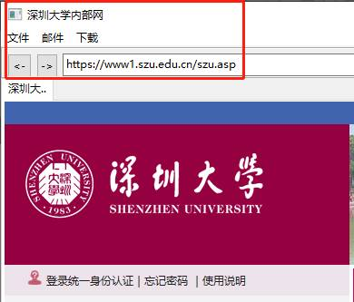
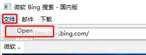

## Web服务器实现的功能：

1. 对于HTTP协议中的POST、GET等协议的实现；
2. 能够稳定处理大量并发任务，类似于多客户端进行连接；
3. 回显客户端的请求，并将请求的报文等信息发送回客户端；

 

## 浏览器原型实现的功能：

1. 支持浏览网页的基本功能；
2. 浏览网页时，浏览器窗口的值变为浏览网页的名称；
3. 支持打开本地文件夹的功能；
4. 对于浏览器的功能中搜索引擎功能的实现；
5. 对于浏览器的前进、后退以及刷新功能的实现
6. 对于浏览器的智能搜索栏的实现；
7. 对于浏览器的访问网页的进度条的实现；
8. 对于浏览器可以进行发送邮件功能的实现；
9. 对于浏览器访问网页标签管理功能的实现；
10. 对于浏览器中下载功能的实现；
11. 对于浏览器记录收藏网址/书签栏的实现；
12. 能够与实现的web服务器进行通信；

## Web服务器实现结果

#### 对于GET请求的请求处理：

- 如图1所示为客户端向服务器请求一张名为2.png的图片，在图2中可见已经请求成功并且已经传输到了客户端的目录下了；其中服务器给出的正确响应为图8左边所示，显示了对于请求的一些详细信息；图3所示为显示在客户端接收到了服务器中的图片文件之后并且能够正常打开；

  
 

图 1：客户端向服务器请求一张名为2.png的图片

  
 

图 2：请求成功并传输成功

  
 

图 3：成功传输并打开图片查看

#### 对用户POST请求的处理：

- 如图4所示为客户端向服务器发送对于1.jpg的内容；

  
 

图 4：向服务器发出POST 1.jpg的请求

- 如图5所示，需要根据服务器端中存储的数据库，即database.txt文件中的登录昵称以及登录密码输入之后，才能够让服务区向客户端发送出用户名的操作；

- 如图6所示以及图4所示，从图4中可以制到执行完POST 1.jpg请求之后，服务器发送cookie值“name：Jamse-”给客户端，之后客户端便将自己存储空间中的cookie.txt中的值修改为从服务器发送给客户端的cookie值；

  
 

图 5：服务器端的数据库数据

  
 

图 6：执行完POST指令之后的客户端的cookie值

#### 能够稳定处理大量并发任务

类似于多客户端进行连接：（使用jmeter软件进行测试服务器在处理大量并发任务时的情况）

- 如图7所示，使用jmeter软件进行测试HTTP请求，其中首次测试的线程数为200，循环次数为10；如图8所示，进行测试的时候，对于GET请求进行测试，其中的IP都是使用自己在代码中规定的数据；

  
 

图 7：使用jmeter软件进行测试

  
 

图 8：测试参数

- 如图9所示，可见在线程数为200、循环次数为10次时，出现的异常率为5.40%，出现异常是该请求所能够承受的过载；

  
 

图 9：测试结果

- 如图10所示是我使用不同数据即不同线程数进行测试的异常率数据表，图11为器对应的折线图；可见在处理较少线程数的时候异常率会减少很多；其中，在80线程数时，波动不大，因此在考虑实际问题时将客户量适当提高又不会很明显的影响异常率的时候，是能够提升很多客户容量的；

  
 

图 10：数据表

  
 

图 11：在不同线程下的异常率

#### 回显客户端的请求，并将请求的报文等信息发送回客户端：

- 如图12所示，在使用客户端进行访问服务器的文件时，即使用自行开发的浏览器原型去使用“localhost”访问服务器的本地资源中的index.html文件，服务器会向客户端（在此处为自行开发的浏览器原型）请求相对应的报文请求。如图12所示，即为此次操作对于访问服务器文件时，服务器做出的响应客户端的请求的报文头，在图13中也可以看出来能够正常得访问该index.html文件；

  
 

图 12：响应客户端的请求信息

  
 

图 13：访问成功界面

## 浏览器实现结果

#### 支持浏览网页的基本功能：

- 如图14所示，对于浏览器基本的浏览网页的功能是能够实现的；之后继续对于其他网页进行浏览，如图15所示，在进行访问百度网页时依旧能够访问，可见其功能；

  
 

图 14：网页浏览

  
 

图 15：访问百度网页

#### 浏览网页时，浏览器窗口的值边为所浏览网页的名称：

- 如图16所示，因为在第1点中可以知道默认网页是bing，在图26中也能够看见在默认网页中浏览器窗口的名称就是bing网站的名称，即“微软Bing搜索 – 国内版”；

  
 

图 16：默认网页的窗口名称

- 如图17所示，在对于访问内部网的时候，便会将浏览器窗口的名称修改为深圳大学内部网的名称；可见在对于浏览对应网页时，浏览器的窗口名称会灵动的修改为所浏览网页的网址的名称；

  
 

图 17：修改网页窗口名称

#### 支持打开本地文件夹的功能：

-  如图18所示，对于浏览器打开本地文件夹功能的实现，在图29中点击在浏览器左上角得菜单栏中的文件 -> Open，就是依次点击文件和Open按钮就可以进行打开本地的文件夹功能；图19为点击之后，能够进行打开本地文件夹功能的结果实现；

  
 

图 18：打开本地文件夹的功能实现

  
 

图 19：打开本地文件夹功能结果

#### 对于浏览器的前进、后退以及刷新功能的实现：

- 如图20所示，访问百度网站时（之前的默认网页是bing网页，之后的网页是我自行访问的新浪网页），提供的选择有进行前进向新浪网页进行继续访问新浪网页，即点击“->”按钮即可进行对于新浪网页访问；也可以点击“<-”按钮回到最初的默认网页，即在点击“<-”之后，会回到bing首页；

  
 

图 20：示例

#### 对于浏览器的智能搜索栏的实现：

- 如图21所示，在默认界面中的地址栏中搜索“中国”，即搜索非网址的内容；在图22中可见，搜索非网址内容的结果是使用百度搜索的引擎进行搜索；因此，对于智能地址栏的实现就是在地址栏键入的内容是非网址的时候，就会使用一个默认的引擎进行搜索键入的内容；（在这里我是用的默认引擎是百度）

  
 

> 
图 21：在地址栏进行搜索非网址内容

  
 

图 22：搜索非网址内容结果

#### 对于浏览器可以进行发送邮件功能的实现

- 如图23所示，在浏览器的菜单栏中含有邮件的按钮，在此菜单下还有发送的按钮下拉框；同时，在点击该“发送”按钮之后便会弹出一个发送邮件的窗口，如图24所示；

  
 

图 23：邮件发送按钮所在位置

  
 

图 24：点击发送之后弹出的邮件窗口
